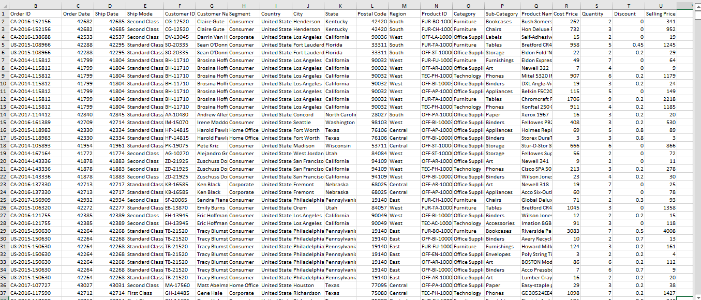
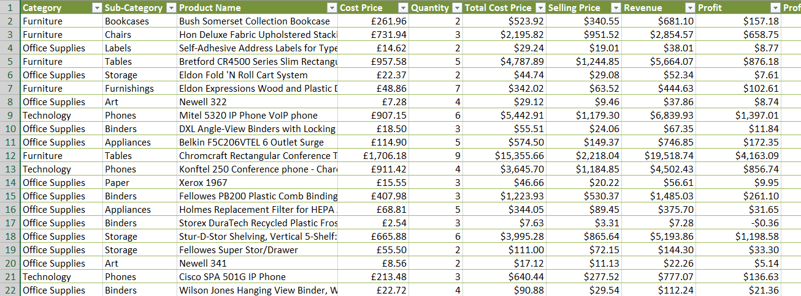
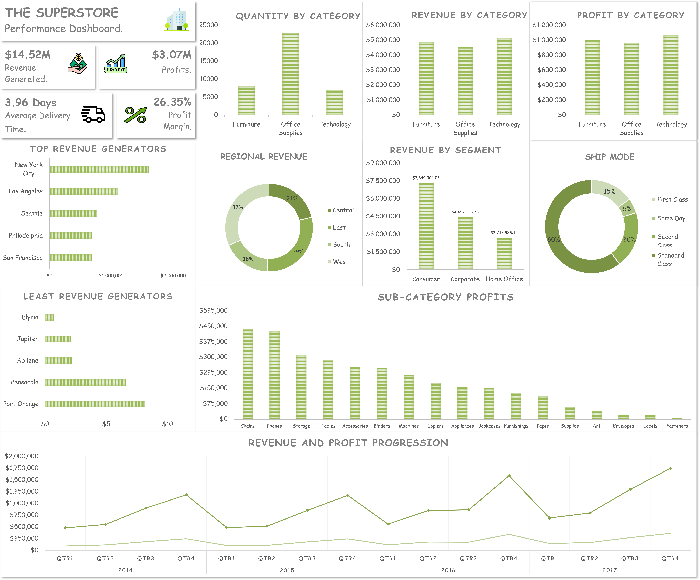

# Sales-Analysis
*A data-driven approach to boost a store’s growth.*

## Introduction
The dataset is a sales record for a retail business located in the United States. It contains information on three main product categories: furniture, office supplies, and technological products. The dataset includes sales data for a wide range of customers, including consumers, home offices, and corporate entities, across 531 cities in 49 states of the U.S.

## Problem Statement 
The store generated a huge amount of data from sales over the past 4 years which has lied dormant and without use. The owners hope to leverage on it to help drive the growth of the store over the coming years.

## Basis
The project is to provide valuable insights to drive better business decisions. The following criteria would be used for analysis:

* performance of product categories in terms of quantity sold, revenue and profit
* performance of sub-categories
* the preferred ship mode among customers
* the biggest revenue generator among all customer segments
* the regions and cities with revenue generated and profit made
* year by year performance of the store.

## Data Preparation and Exploration
The dataset was downloaded and accessed with Microsoft Excel as it was already in a .xlsx format. 
 

 
 

It provides detailed information on each transaction, including the order date, ship date, customer name, product name, product category, sales revenue, and shipping cost. In addition to these transactional details, the dataset also includes information on customer demographics, such as their state, city, and zip code.

## Data Cleaning and Transformation
Common issues such as identifying missing data(empty cells), misspellings, duplicate data were sorted to ensure the integrity of the data.

Columns were formatted with prices set to the currency, order and ship dates columns set to the short date format and others converted to correlate with their corresponding data types. Some new columns were also created with feature engineering.
 

 
 

## Analysis/Insights
* The store generated about $14.5M in revenue across all categories over the 4 year period with a growth rate of 13.3%. It also made profit of $3M with a profit margin of 26.35(a very good percentage).
* Incessant discounting of products hindered profits that could have been made.
* Office supplies were dominant in terms of quantity sold but stood out as the category which generated the leat revenue and profit. Technological products on the other hand had the least quantity sold but was the most profitable category.
* New York generated the highest revenue and profit and is followed by Los angeles. These cities are the 1st and 3rd largest in the USA in terms of population. 
* The least profitable cities generated minimal revenue with most incurring losses. These cities, apart from being less populated, were offered a high average discount (providing a product for free for every product sold) for each product they bought. Also, it was found that, a considerable amount of th least profitable cities were located in Florida, a state renowned for resorts, tourism, recreation, boating and fishing activities. This doesn't fit the demographic of working class people that serve as customers for the store.
* Standard class (which takes an average of 5 days) is the preferred mode of shipment catering for 60% of product deliveries.
---

---

## Recommendations

* The store may want to consider adjusting its discount strategy based on analysis that shows discounts have significantly reduced its profits. While it is important to maintain a competitive edge by offering discounts, the store should be cautious not to eliminate them altogether since they serve as a means of attracting customers. To achieve a balance, the store could explore these options individually or in combination:

(i). reducing the discount ratio

(ii). using discounts only when items have spent time in without being sold

(iii). applying them for long time, repeat or devoted customers and organizations as incentives.
* Building a network of local warehouses to better optimize delivery.
* The store may consider reallocating its resources to focus more on cities or regions where profits are higher and less on those where losses are being incurred, based on data that suggests that the store's products may not be well-suited to the needs of customers in those areas. Additionally, the store could explore the possibility of introducing a new line of products that caters to the needs of those customers. For instance, since Florida as a state has the third largest population in the United States, it presents an opportunity for the store to capitalize on the needs of that particular market segment.
* Inventory should always be stacked for top selling products and sub-categories.
* The selling price of items with low profit margins should be revisited or lower cost prices bargained for from suppliers.
---
Full article on [medium.](https://medium.com/@seyi_/project-1-sales-analysis-using-excel-4f6c2629e31)
